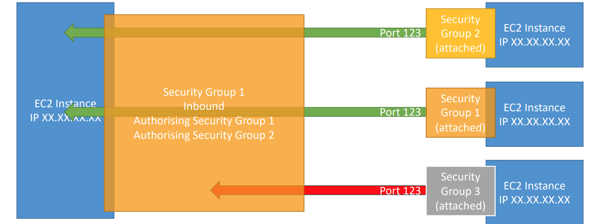

### **Amazon EC2 (Elastic Compute Cloud)**  

- O EC2 é um dos serviços mais populares da Amazon Web Services (AWS).  
- É chamado de **Elastic Compute Cloud** e faz parte do modelo de **Infraestrutura como Serviço (IaaS)**.  
- Basicamente, o EC2 oferece:  
  - **Aluguel de máquinas virtuais** para executar seus aplicativos.  
  - **Armazenamento de dados em discos virtuais** (chamados de EBS).  
  - **Distribuição de carga de trabalho** entre várias máquinas (usando ELB).  
  - **Escalabilidade automática** com grupos que aumentam ou diminuem os recursos conforme a demanda (Auto Scaling Group - ASG).  
- Entender o EC2 é essencial para compreender como a nuvem funciona.

### Dimensionamento e opções de configuração do EC2  

• **Sistema Operacional (SO):** Linux, Windows ou Mac OS  
• **Quantidade de poder computacional e núcleos (CPU)**  
• **Quantidade de memória de acesso aleatório (RAM)**  
• **Quantidade de espaço de armazenamento:**  
  - Conectado à rede (EBS e EFS)  
  - Hardware (EC2 Instance Store)  
• **Placa de rede:** velocidade da placa, endereço IP público  
• **Regras de firewall:** grupo de segurança  
• **Script de inicialização (configuração no primeiro lançamento):** EC2 User Data

### **EC2 User Data**  
• É possível inicializar (bootstrap) nossas instâncias usando um script do **EC2 User Data**.  
• **Bootstrapping** significa executar comandos quando uma máquina é iniciada.  
• Esse script é executado **apenas uma vez**, no primeiro início da instância.  
• O **EC2 User Data** é usado para automatizar tarefas de inicialização, como:  
  - Instalar atualizações  
  - Instalar softwares  
  - Baixar arquivos comuns da internet  
  - Qualquer outra tarefa que você imaginar  
• O script do **EC2 User Data** é executado com o usuário **root**.

### Tipos de instancias. 

O Amazon EC2 oferece uma ampla seleção de tipos de instâncias otimizadas para atender a diferentes casos de uso. Os tipos de instâncias consistem em várias combinações de CPU, memória, armazenamento e capacidade de rede e oferecem flexibilidade de escolha da composição adequada de recursos para os seus aplicativos. Cada tipo de instância inclui um ou mais tamanhos de instância, permitindo a escalabilidade de seus recursos de acordo com os requisitos da workload a ser executada.

https://aws.amazon.com/pt/ec2/instance-types/

### Tipos de Instância EC2 – Uso Geral

-  Excelente para uma diversidade de cargas de trabalho, como servidores web ou repositórios de código.
-  Oferecem equilíbrio entre:

Computação
Memória
Rede

### Tipos de Instância EC2 (EC2 Instance Types) – Otimizadas para Computação (Compute Optimized). .

- Ideais para tarefas intensivas em computação que exigem processadores de alto desempenho:
  - Workloads de processamento em lote
  - Transcodificação de mídia
  - Servidores web de alto desempenho
  - Computação de alto desempenho (HPC)
  - Modelagem científica e aprendizado de máquina
  - Servidores dedicados para jogos

### **Tipos de Instância EC2 (EC2 Instance Types) – Memory Optimized**  
• Desempenho rápido para workloads que processam grandes volumes de dados na memória.  
• Casos de uso:  
  - **Bancos de dados relacionais/não relacionais de alto desempenho**  
  - **Armazenamento em cache distribuído em escala web**  
  - **Bancos de dados em memória otimizados para BI (business intelligence)**  
  - **Aplicações que realizam processamento em tempo real de grandes dados não estruturados**

**Tipos de Instância EC2 (EC2 Instance Types) – Storage Optimized**  
• Ideais para tarefas intensivas em armazenamento que exigem alto desempenho em leituras e gravações sequenciais de grandes volumes de dados no armazenamento local.  
• Casos de uso:  
  - **Sistemas de processamento de transações online (OLTP) de alta frequência**  
  - **Bancos de dados relacionais e NoSQL**  
  - **Cache para bancos de dados em memória (por exemplo, Redis)**  
  - **Aplicações de data warehouse**  
  - **Sistemas de arquivos distribuídos**

### **Introdução aos Grupos de Segurança (Security Groups)**  
• Os Security Groups são a base da segurança de rede na AWS.  
• Eles controlam como o tráfego é permitido para dentro ou fora das nossas instâncias EC2.  

• Os Security Groups contêm apenas regras.  
• As regras dos Security Groups podem fazer referência por IP ou por outro Security Group.  

## Security Groups

### Visão Geral
Os grupos de segurança atuam como um "firewall" para instâncias EC2. Eles regulam:

- Acesso às Portas
- Faixas de IP autorizadas - IPv4 e IPv6
- Controle de rede de entrada (de outros para a instância)
- Controle de rede de saída (da instância para outros)

### Diagrama 

## Pontos Importantes
- Podem ser anexados a várias instâncias
- Estão vinculados a uma combinação de região/VPC
- Operam "fora" da instância EC2 – se o tráfego for bloqueado, a instância EC2 não o verá
- É recomendável manter um grupo de segurança separado para acesso SSH
- Se sua aplicação não estiver acessível (timeout), o problema está no grupo de segurança
- Se sua aplicação apresentar o erro "connection refused", então é um problema na aplicação ou ela não foi iniciada
- Todo o tráfego de entrada é bloqueado por padrão
- Todo o tráfego de saída é autorizado por padrão

## Referenciando Outros Grupos de Segurança
Os grupos de segurança podem ser configurados para referenciar outros grupos de segurança dentro da mesma VPC. Isso permite criar regras de tráfego que permitem ou negam acesso entre recursos associados a diferentes grupos de segurança.

### Diagrama

A seguir, um exemplo simplificado de como funciona a referência entre grupos de segurança:

## Ports

- 22 = SSH (Secure Shell) - acesso a uma instância Linux
- 21 = FTP (File Transfer Protocol) - upload de arquivos para um compartilhamento de arquivos
- 22 = SFTP (Secure File Transfer Protocol) - upload de arquivos usando SSH
- 80 = HTTP - acesso a sites não seguros
- 443 = HTTPS - acesso a sites seguros
- 3389 = RDP (Remote Desktop Protocol) - acesso a uma instância Windows

## Opções de Compra de Instâncias EC2

- **On-Demand Instances** – cargas de trabalho curtas, preço previsível, pagamento por segundo
- **Reserved (1 e 3 anos)**  
  - **Reserved Instances** – cargas de trabalho longas  
  - **Convertible Reserved Instances** – cargas de trabalho longas com instâncias flexíveis
- **Savings Plans (1 e 3 anos)** – compromisso com uma quantidade de uso, para cargas de trabalho longas
- **Spot Instances** – cargas de trabalho curtas, econômicas, com possibilidade de perda de instâncias (menos confiáveis)
- **Dedicated Hosts** – reserva de um servidor físico inteiro, controle total sobre o posicionamento das instâncias
- **Dedicated Instances** – nenhum outro cliente compartilhará seu hardware
- **Capacity Reservations** – reserva de capacidade em uma Zona de Disponibilidade específica por qualquer duração

## EC2 On-Demand

- **Pague pelo que usar:**
  - **Linux ou Windows**: cobrança por segundo, após o primeiro minuto
  - **Todos os outros sistemas operacionais**: cobrança por hora
- Maior custo, mas sem pagamento antecipado
- Sem compromisso de longo prazo
- Recomendado para cargas de trabalho de curto prazo e ininterruptas, onde não é possível prever o comportamento da aplicação

## EC2 Reserved Instances

- **Desconto de até 72%** em comparação com On-Demand
- Você reserva atributos específicos da instância (Tipo de Instância, Região, Tenancy, SO)
- **Período de Reserva**: 1 ano (+desconto) ou 3 anos (+++desconto)
- **Opções de Pagamento**:  
  - Sem pagamento antecipado (+)  
  - Parcialmente antecipado (++)  
  - Totalmente antecipado (+++)
- **Escopo da Instância Reservada**: Regional ou Zonal (reserva de capacidade em uma AZ)
- Recomendado para aplicações de uso constante (como bancos de dados)
- Você pode comprar e vender no **Marketplace de Instâncias Reservadas**

### Convertible Reserved Instance
- Permite alterar o tipo de instância EC2, família de instância, sistema operacional, escopo e tenancy
- **Desconto de até 66%**

## EC2 Spot Instances

- **Desconto de até 90%** em comparação com On-Demand
- Instâncias que podem ser \"perdidas\" a qualquer momento se o seu preço máximo for menor que o preço spot atual
- **Instâncias mais econômicas** da AWS
- Útil para cargas de trabalho resilientes a falhas, como:  
  - Jobs em batch  
  - Análise de dados  
  - Processamento de imagens  
  - Cargas de trabalho distribuídas  
  - Cargas de trabalho com horários de início e término flexíveis
- **Não recomendado** para trabalhos críticos ou bancos de dados

## EC2 Dedicated Hosts

- **Servidor físico** com capacidade de instâncias EC2 totalmente dedicado ao seu uso
- Permite atender a requisitos de conformidade e utilizar suas licenças de software vinculadas ao servidor (por socket, por núcleo, ou por VM)
- **Opções de Compra:**  
  - **On-Demand**: pague por segundo enquanto o Dedicated Host estiver ativo  
  - **Reservado**: 1 ou 3 anos (Sem pagamento antecipado, Parcialmente antecipado, Totalmente antecipado)
- **Opção mais cara** disponível
- Útil para:  
  - Software com modelos de licenciamento complexos (**BYOL – Bring Your Own License**)  
  - Empresas com fortes necessidades regulatórias ou de conformidade

## EC2 Dedicated Instances

- As instâncias são executadas em hardware **dedicado exclusivamente a você**
- Podem compartilhar o hardware com outras instâncias **dentro da mesma conta**
- **Sem controle sobre o posicionamento das instâncias** (o hardware pode ser alterado após um comando de Stop/Start)

# Reservas de Capacidade EC2

- Reserve capacidade de instâncias sob demanda em uma AZ específica por qualquer duração.
- Você sempre terá acesso à capacidade do EC2 quando precisar.
- Sem compromisso de tempo (crie/cancele a qualquer momento), sem descontos de cobrança.
- Combine com Instâncias Reservadas Regionais e Planos de Economia para aproveitar descontos na cobrança.
- Você será cobrado na tarifa sob demanda, independentemente de executar instâncias ou não.
- Adequado para cargas de trabalho de curto prazo e ininterruptas que precisam estar em uma AZ específica.

# Qual opção de compra é a certa para mim?

- **Sob demanda**: como se hospedar no resort sempre que quisermos, pagando o preço total.
- **Reservado**: se gostamos de planejar com antecedência e se vamos ficar por um longo período, podemos obter um bom desconto.
- **Planos de Economia**: pagamos um valor fixo por hora por um período determinado e podemos ficar em qualquer tipo de quarto (ex.: King, Suíte, Vista para o Mar, ...).
- **Instâncias Spot**: o hotel permite que as pessoas façam lances pelos quartos vazios, e o maior lance garante o quarto. Você pode ser convidado a sair a qualquer momento.
- **Hosts Dedicados**: reservamos um edifício inteiro do resort.
- **Reservas de Capacidade**: você reserva um quarto por um período pagando o preço total, mesmo que não se hospede nele.

# Solicitações de Instâncias Spot EC2

- Pode-se obter um desconto de até 90% em comparação com o modelo Sob Demanda.
- Defina o preço máximo do spot e obtenha a instância enquanto o preço atual do spot for inferior ao preço máximo.
- O preço horário do spot varia com base na oferta e na capacidade.
- Se o preço atual do spot for superior ao seu preço máximo, você pode escolher parar ou terminar sua instância, com um período de carência de 2 minutos.
- Outra estratégia: **Spot Block**
  - "Bloqueia" a instância spot durante um período específico (de 1 a 6 horas) sem interrupções.
  - Em situações raras, a instância pode ser recuperada.
  - Usado para jobs em lote, análise de dados ou cargas de trabalho resilientes a falhas.
  - Não é ideal para jobs críticos ou bancos de dados.

# Fleets Spot

- **Fleets Spot** = conjunto de Instâncias Spot + (opcional) Instâncias Sob Demanda.
- O **Spot Fleet** tentará atender à capacidade alvo com restrições de preço.
- Defina os possíveis pools de lançamento: tipo de instância (m5.large), SO, Zona de Disponibilidade.
- Pode ter múltiplos pools de lançamento, para que a fleet possa escolher.
- O Spot Fleet para de lançar instâncias ao atingir a capacidade ou o custo máximo.
  
## Estratégias para alocar Instâncias Spot:
- **lowestPrice**: do pool com o preço mais baixo (otimização de custo, carga de trabalho curta).
- **diversified**: distribuído por todos os pools (ótimo para disponibilidade, cargas de trabalho longas).
- **capacityOptimized**: pool com a capacidade ideal para o número de instâncias.
- **priceCapacityOptimized** (recomendado): pools com maior capacidade disponível, depois seleciona o pool com o menor preço (melhor escolha para a maioria das cargas de trabalho).
  
- **Spot Fleets** permitem solicitar automaticamente Instâncias Spot com o preço mais baixo.
